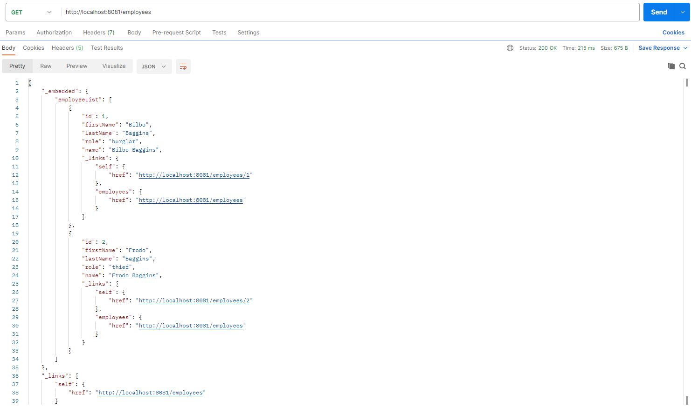
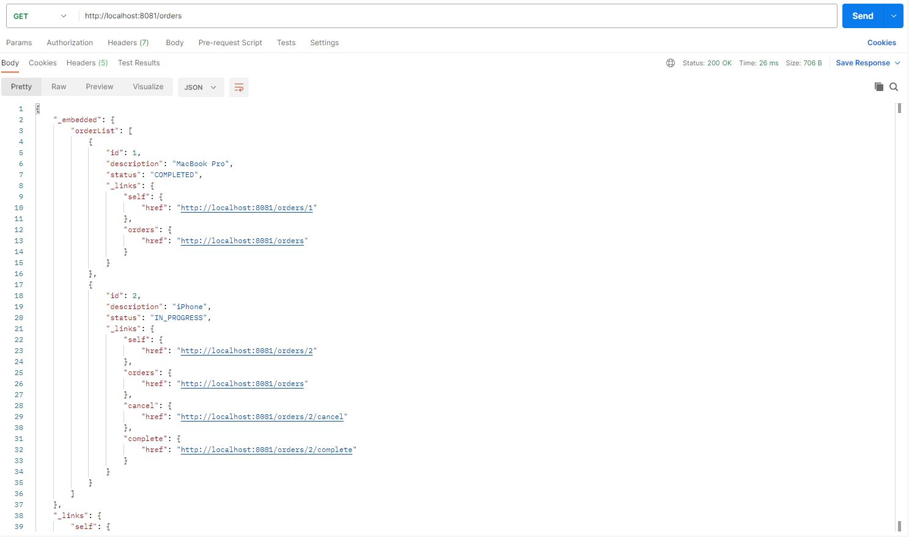

# Payroll Service

Данный проект представляет собой REST API сервис.  
Реализованный функционал:
* создавать/редактировать/удалять учетные записи сотрудников;
* управлять жизненным циклом заказов.

## Стек технологий
* Java 17
* Apache Maven 3.8.5
* Spring Boot 2.7.12
* H2 Database 2.1.214
* Lombok 1.18.26
* Hateoas 1.5.4

## Требуемое окружение для запуска проекта
* Postman
* JDK 17
* Apache Maven 3.8

## Инструкция по запуску проекта
1) Скачать и разархивировать проект
2) Открыть командную строку и перейти в папку с проектом, например `cd c:\projects\payroll`
3) Выполнить команду `mvn install`
4) Перейти в папку target командой `cd target`
5) Выполнить команду `java -jar payroll-1.0.jar`

## Примеры взаимодействия с приложением

### Вывести всех сотрудников

### Вывести все заказы

## Контакты для связи
&nbsp;&nbsp;
&nbsp;&nbsp;
